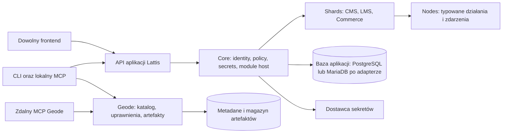

# 01. Plan całego systemu Lattis

Ten dokument utrwala decyzje architektoniczne. Bieżąca ścieżka użycia istniejącego kodu jest opisana w [05 — Pierwsza aplikacja](05-implementacja-fazy-1.md), a luki ujawnione przez Persec i backlog przenośnej kompozycji w [06 — Kompozycja i porty](06-kompozycja-porty-i-backlog.md).

**Status:** robocza propozycja v0.1. Rozróżnienie ustaleń i rekomendacji znajduje się w [rejestrze decyzji](04-decyzje-i-zrodla.md).

## 1. Teza produktu

Lattis dostarcza powtarzalny, bezpieczny fundament dla aplikacji webowej. Instaluje się go na początku projektu. Aplikacja dostaje tożsamość, sesje, autoryzację, referencje do sekretów, kontrakty modułów, API i drogę do ich wersjonowania. Framework frontendu pozostaje wyborem autora aplikacji. Pierwszym odbiorcą jest własna aplikacja łącząca CMS, LMS i sprzedaż ze wspólnymi użytkownikami. Publiczny self-hosting Lattis przez innych jest późniejszym celem.

Lattis nie wymusza grafu, Canvas ani panelu administracyjnego do wykonywania zwykłych funkcji biznesowych. API, CLI i MCP są pełnoprawnymi interfejsami od pierwszej fazy. Geode jest wspólnym rejestrem Node'ów i Shardów od pierwszej aplikacji.

### Cele i mierzalny rezultat pierwszego zastosowania

1. Nowy projekt powstaje z Lattis Core, bez przepisywania logowania, użytkowników i uprawnień.
2. Frontend może korzystać z kontraktu HTTP niezależnie od frameworka; SDK TypeScript jest wygodą, a nie jedyną drogą.
3. Pakiet stworzony dla pierwszej aplikacji da się wydzielić, opublikować prywatnie w Geode i zainstalować w drugim projekcie bez kopiowania plików.
4. Publiczny pakiet ma opis, licencję i niezmienną wersję, lecz sama publikacja nie daje mu prawa uruchamiania niezaufanego kodu w procesie aplikacji.
5. Utrata łączności z Geode nie zatrzymuje już wdrożonej aplikacji.

### Poza pierwszym zakresem

Panel Lattis Studio, Canvas, wykonywalny Graph AST, The Forge, ogólnodostępni wydawcy zewnętrzni, rozliczenia i wypłaty Geode, pełny runtime niezaufanego kodu, SaaS multi-tenancy i narzucanie design systemu frontendom klientów. Model danych uwzględnia późniejsze rozszerzenia, ale nie udaje, że te funkcje już istnieją.

## 2. Granice architektury



**Instancja Lattis** należy do jednej aplikacji. Jest instalowana jako zależności i szkielet backendu w jej repo; może działać jako osobny proces/API obok dowolnego frontendu. Ma własne dane i własne wydania. **Geode** jest centralną usługą współdzieloną między projektami, z osobnym modelem kont wydawców, organizacji i praw do pakietów. Użytkownik kursu lub redaktor CMS nie staje się automatycznie wydawcą Geode.

Docelowo Core udostępnia porty: `Identity`, `Policy`, `Secrets`, `ModuleRegistry`, `NodeInvoker`, `EventBus/Outbox`, `Audit`, `Persistence/UnitOfWork`, `Storage`, `Clock`. Implementacje DB, serwera HTTP, dostawcy sekretów i transportów MCP są adapterami. Shard używa portów i jawnych kontraktów; nie sięga bezpośrednio do prywatnych tabel innego Shardu. Jedna relacyjna baza per aplikacja może wystarczyć na początku, z migracjami przypisanymi do właściciela modułu. **Obecny kod nie realizuje wszystkich wymienionych portów:** podaje `pg.PoolClient` do handlerów, nie ma `NodeInvoker` ani trwałego EventBus. Wymagania i kolejność napraw opisuje [06](06-kompozycja-porty-i-backlog.md).

Nie potrzeba osobnego kontenera ani bazy dla każdego Shardu. Instalacja pakietu jest częścią przygotowania **nowego wydania aplikacji**, a nie pobraniem dowolnego kodu do działającego procesu. To umożliwia pinowanie zależności i kontrolowane migracje. Zewnętrzny kod ma osobną granicę wykonania, zanim zostanie dopuszczony do produkcji.

## 3. Słownik i model rozszerzeń

| Termin | Nowa rola | Granica |
|---|---|---|
| **Node** | Mała, wersjonowana jednostka działania lub zdarzenia z typowanym wejściem i wyjściem. Może być dostarczona przez Shard albo osobny pakiet. | Nie musi mieć UI, pozycji na Canvas ani dostępu do bazy. Deklaruje potrzebne capabilities. |
| **Shard** | Pakiet funkcjonalny: może zawierać Nodes, usługi domenowe, własny model danych, migracje, API i polityki. | Jest właścicielem swoich danych; zależności od innych Shardów deklaruje w manifeście. |
| **Crystal** | Nazwa marketingowa konkretnej aplikacji/instancji Lattis. | Nie oznacza automatycznie kontenera, pełnego AST ani globalnej bazy. |
| **Graph AST** | Wersjonowany format opisu przepływów między Nodes w przyszłej warstwie automatyzacji. | Nie modeluje użytkowników, sesji, licencji, całego CMS ani wszystkich relacji w bazie. |
| **Geode** | Rejestr niezmiennych wersji Nodes i Shardów, z katalogiem, widocznością, ofertami i prawami instalacji. | Nie jest krytycznym zależnym serwisem dla obsługi bieżących żądań aplikacji. |
| **MCP** | Adapter narzędzi dla agentów: lokalny przy projekcie i zdalny przy Geode. | Nie omija tych samych usług, uprawnień i audytu co API/CLI. |

W pierwszym działającym wycinku Node typu `command` lub `query` wywołuje się przez API; wywołanie Node z innego Node i typowane zdarzenia są nadal pracą do wykonania. Shard ma docelowo komponować te działania zwykłym kodem i kontraktami przez port Core. Późniejszy Graph AST może opisać część tych połączeń deklaratywnie, bez innej semantyki uprawnień i idempotencji. Kontrakt Node trzeba więc ustalić teraz, lecz edytor i silnik dowolnych grafów mogą poczekać.

## 4. Wybór technologii bazowej

| Opcja | Zalety | Koszt/ryzyko | Ocena dla pierwszej aplikacji |
|---|---|---|---|
| **A. TypeScript + Node.js + Fastify + adapter relacyjnej bazy aplikacji** | Jeden język dla Core, SDK, CLI, lokalnego MCP i większości modułów; dojrzałe pakietowanie; schematowe HTTP. | Kod pakietu działający w procesie ma uprawnienia procesu. Porty i migracje PostgreSQL/MariaDB wymagają pracy; niezaufany kod wymaga osobnej granicy. | **Docelowa rekomendacja.** Główny kod powstał dla PostgreSQL; fork Persec dla MariaDB trzeba scalić przez porty. |
| **B. TypeScript + Deno + PostgreSQL** | Uprawnienia procesu domyślnie ograniczone; zgodny język dla modułów. | Uprawnienia nie odseparują dwóch modułów na jednym wątku; integracje i wdrożenie trzeba sprawdzić dla konkretnych wymagań. | Warto rozważyć jako przyszły worker dla wybranych Nodes, nie automatyczną gwarancję sandboxu. |
| **C. Go + PostgreSQL, SDK TypeScript** | Prosty artefakt serwera, jawne interfejsy i mały narzut runtime. | Oddzielny język dla Core i twórców Nodes; wolniejsze wyciąganie kodu TypeScript z aplikacji do Geode. | Sensowne po wzroście skali lub potrzeb operacyjnych, mniej korzystne na start. |

W opcji A Fastify jest **adapterem HTTP**, a nie modelem domeny. Jego dokumentacja potwierdza obsługę schematów, ale ostrzega, że kompilacja walidatorów z nieufnych schematów jest niebezpieczna; manifesty z Geode muszą przejść odrębną kontrolę i nie trafiać bezpośrednio do kompilatora tras. [Fastify: Validation and Serialization](https://fastify.dev/docs/latest/Reference/Validation-and-Serialization/). Deno ogranicza I/O domyślnie, lecz kod na tym samym wątku dzieli poziom uprawnień; samo „Deno isolate per Node” z pierwotnego RFC nie jest pełnym projektem izolacji. [Deno: Security and permissions](https://docs.deno.com/runtime/fundamentals/security/).

**Początkowy wybór implementacyjny:** TypeScript, Node.js, Fastify jako HTTP adapter i PostgreSQL w głównym repo. Persec używa lokalnego forka Core z MariaDB, więc PostgreSQL nie może już być ukrytą częścią publicznego kontraktu Node/Shard. [ADR-C06](06-kompozycja-porty-i-backlog.md) proponuje adaptery PostgreSQL i MariaDB dla instancji aplikacji; Geode może zachować PostgreSQL. Ten port **nie jest jeszcze zaimplementowany w głównym repo**. OpenAPI ma stać się wiernym publicznym kontraktem, lecz dziś obejmuje tylko część schematów. Redis, osobny broker kolejek, wyszukiwarka i zewnętrzny storage wchodzą według potrzeb produktu; trwały outbox może początkowo używać bazy aplikacji.

### Organizacja bieżącego repo

```text
lattis/
  src/                          # Core, API, Geode, MCP, CLI i kontrakt Node
  db/                           # schematy Core i Geode
  openapi/                      # zarys publicznego API
  docs/

moja-aplikacja/                  # osobny projekt tworzony przez lattis init
  packages/local/               # własne Node i Shards
  migrations/                   # SQL domeny aplikacji
  lattis.config.json            # zaufane moduły i migracje
  lattis.lock                   # dokładne wersje pakietów Geode
```

Frontend aplikacji może mieszkać w tym samym repo lub osobno. Bieżąca struktura jest płaska; wydzielanie pakietów można wykonać później, gdy kontrakty się ustabilizują.

## 5. Roadmapa oparta na zależnościach

| Etap | Rezultat | Zależność i świadome ograniczenie |
|---|---|---|
| **0. Zamknięcie kontraktów** | ADR dla stosu, tożsamości, sekretów, artefaktów, typów Node/Shard i semantyki subskrypcji. | Bez nich nie zamrażać publicznego formatu pakietu. |
| **1A. Core bez UI** | Bootstrap projektu, identity, sesje, autoryzacja, sekrety jako referencje, module host, API, audyt, baza i migracje. | Tylko pakiety zaufanego właściciela działają w procesie. |
| **1B. Geode i narzędzia tworzenia** | CLI/SDK do Node/Shard, prywatna i publiczna publikacja, niezmienne wersje, wyszukiwanie, instalacja, lockfile, oferty i ręczne entitlementy. | Bez checkout i wypłat. |
| **1C. MCP** | Lokalny serwer stdio oraz publicznie dostępny zdalny serwer Geode przez Streamable HTTP z ochroną operacji zapisu. | Oba korzystają z usług 1A/1B, nie z osobnej logiki uprawnień. |
| **1D. Domknięcie kontraktów w realnej aplikacji** | Wprowadzić przenośny kontrakt, kompozycję Node, outbox/efekty, ingress i aktywację zaufanego pakietu według [backlogu 06](06-kompozycja-porty-i-backlog.md). | Persec i drugie wdrożenie sprawdzają drogę przez Geode; sam lockfile nie dowodzi instalacji. |
| **2. Pierwszy produkt** | Shards CMS, LMS i Commerce; sprzedaż kursu przez zewnętrznego dostawcę płatności, niezawodne przyznawanie dostępu. | Płatności w aplikacji są odrębne od rozliczeń Geode. |
| **3. Panel administracyjny** | Shell panelu, logowanie, nawigacja modułów, uprawnienia i formularze konfiguracyjne. | UI jest klientem tych samych API; Design System dotyczy panelu. |
| **4. Automatyzacje** | Wersjonowany Graph AST, wykonawca przepływów, bezpieczne środowisko niezaufanego kodu, później Canvas/Code Node. | Korzysta z istniejących kontraktów Node, nie redefiniuje Core. |
| **5. AI i rynek** | Forge jako autor propozycji zmian; płatności, odnawianie, wydawcy zewnętrzni, przegląd i wypłaty Geode. | Potrzebne dane o rzeczywistym użyciu oraz osobne bramki prawne i bezpieczeństwa. |

### Kontrakty przygotowane pod dalsze etapy

- **Panel (etap 3):** shell panelu jest klientem API Core i Shardów. Moduł może zadeklarować pozycje nawigacji, widoki i formularze konfiguracji przez wersjonowany kontrakt. Domyślnie stosować formularze tworzone z zaufanych schematów; kod UI obcego wydawcy wymaga oddzielnej izolacji i ograniczonego kanału komunikacji. Design System porządkuje panel Lattis, nie frontend aplikacji końcowej.
- **Automatyzacje (etap 4):** Graph AST opisuje przepływ między opublikowanymi kontraktami Node, z przypiętymi wersjami, typowanymi krawędziami, triggerami, referencjami do sekretów i jawnymi punktami efektów ubocznych. Edytory mogą wytwarzać semantycznie równoważny, kanoniczny format. Konkurencyjne edycje, pętle, retry i idempotencja potrzebują jawnych reguł; nie wynikają z samego JSON.
- **The Forge (etap 5):** agent używa CLI/MCP/API i proponuje zmianę w repo lub wersjonowanym przepływie. Przed wdrożeniem powstaje plan, różnica, lista nowych capabilities i ślad audytu. Agent nie zyskuje szerszych praw niż aktor, który go uruchomił. Integracja modelu AI pozostaje wymienna.
- **Rynek zewnętrzny (etap 5):** dopuszczenie obcych wydawców wymaga tożsamości wydawcy, pochodzenia pakietu, zasad licencji, procesu zgłoszeń, izolowanego runtime, reagowania na wycofane pakiety i dopiero potem rozliczeń/payout. Publiczny odczyt katalogu w fazie 1 nie oznacza otwartej publikacji ani automatycznej instalacji obcego kodu.
- **Cloud/enterprise (później):** wspólne lub odrębne instancje, SSO, izolacja danych, SLA i compliance są osobnymi decyzjami zależnymi od popytu. Nie wprowadzać pustych tierów i feature flag dla hipotetycznych ofert do fazy 1.

Każdy etap ma osobny plan weryfikacji w [dokumencie 04](04-decyzje-i-zrodla.md), lecz niczego z tego planu nie uruchomiono. Przed uznaniem systemu za bezpieczny lub produkcyjny użytkownik musi wyraźnie zlecić właściwe weryfikacje.

## 6. Co zmienia się wobec pierwotnych dokumentów

| Element | Ocena | Uzasadnienie |
|---|---|---|
| Headless, composable, security-first | **Zachować** | To cel produktu, ale jego spełnienie zależy od rzeczywistych kontraktów, granic zaufania i weryfikacji. |
| Hierarchia Nodes → Shards → Crystals | **Przeprojektować** | Pozostaje słownictwem kompozycji; nie każda funkcja jest grafem ani komponentem Vue. |
| Graph AST jako jedyne źródło prawdy wszystkiego | **Ograniczyć** | Dane auth, licencji i domeny wymagają własnych modeli oraz integralności relacyjnej. Graph AST opisze przyszłe przepływy. |
| Nuxt 4/Nitro jako obowiązkowy runtime | **Usunąć z wymagań** | Backend Lattis wybiera własny stos; frontend klienta pozostaje dowolny. |
| Geode | **Zachować i przesunąć do fazy 1** | Od pierwszej aplikacji ma powstawać wspólna biblioteka Node/Shard. |
| MCP | **Dodać do fazy 1** | Agent potrzebuje tych samych operacji co CLI/API, lokalnie i zdalnie. |
| The Forge, Canvas, Code Node | **Odłożyć** | Nie są wymagane do tworzenia i dystrybucji pakietów; wymagają stabilnych kontraktów i bezpiecznego runtime. |
| Siedem warstw bezpieczeństwa | **Przełożyć na model zagrożeń i etapy** | Niektóre postulaty są wartościowe, ale podpis, Deno czy iframe samodzielnie nie zapewniają zaufania. |
| Design System | **Zachować dla przyszłego panelu** | Nie powinien ograniczać frontendu końcowego ani być warunkiem fazy 1. |
| BSL, tiered pricing, marketplace revenue share | **Otwarta decyzja biznesowa** | Nie kodować poziomów cenowych i twierdzeń prawnych w Core. Przed publikacją warunków potrzebna osobna analiza. |

Szczegółowe odniesienia do fragmentów pięciu dokumentów znajdują się w [mapie źródeł](04-decyzje-i-zrodla.md#5-mapa-źródeł-i-korekt).
