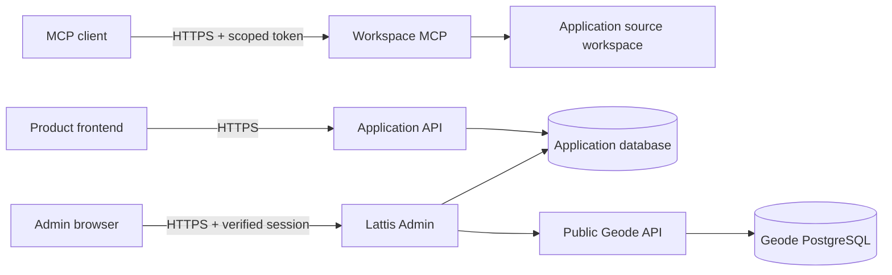

# Zdalny MCP aplikacji i opcjonalny panel administracyjny

> Aktualizacja 0.2.0-alpha.1: bieżący kontrakt instalacji i wdrożenia opisuje [dokument 14](14-publiczne-wydanie-0.2.md). Poniższe przykłady 0.1 zachowano jako kontekst rozwoju; nie są aktualną instrukcją wdrożenia produkcyjnego. Lock v1, dowolny GEODE_BASE_URL, edycja produkcyjnego workspace przez MCP i stary release:prepare nie należą do nowego procesu.

Lattis rozdziela trzy usługi. API aplikacji obsługuje jej użytkowników. **Workspace MCP** pracuje na katalogu źródeł tej konkretnej aplikacji na serwerze. **Lattis Admin** to osobny, opcjonalny proces i adres dla właściciela lub administratorów. Geode pozostaje osobną usługą katalogu z własną bazą PostgreSQL. Panel administracyjny produktu dla jego klientów może mieć inny adres, identyfikację wizualną i uprawnienia; nie jest tym samym panelem co Lattis Admin.



## Zdalny MCP na serwerze aplikacji

Proces `npm run mcp:remote` uruchamiaj z katalogu **projektu aplikacji**, na tej samej maszynie lub zamontowanym wolumenie, na którym znajdują się jej pliki. Ustaw `LATTIS_MCP_PUBLIC_URL=https://mcp.example.com/mcp`, `LATTIS_MCP_HOST=127.0.0.1` i `LATTIS_MCP_PORT=4301`. Reverse proxy przekazuje wyłącznie ścieżkę `/mcp`, zachowuje nagłówek `Host` i kończy TLS. Ustaw `APP_DATABASE_URL`; w produkcji adapter bazy wymaga też `APP_DATABASE_CA_FILE`. `LATTIS_MCP_ALLOWED_ORIGINS` ogranicza żądania przeglądarkowe; klient MCP bez nagłówka `Origin` używa tokenu Bearer.

W panelu **Settings → MCP access keys** można utworzyć i odwołać token. Alternatywą podczas pierwszej konfiguracji jest CLI:

```sh
npm run lattis -- app:service-token remote-editor mcp-read:workspace,mcp-write:workspace,mcp-scaffold:workspace 30
```

CLI zapisuje token do pliku w `.lattis/keys` z ograniczonymi uprawnieniami. Panel pokazuje nowy token tylko raz. Podłącz klienta MCP do publicznego adresu i ustaw `Authorization: Bearer <token>`. Token ma datę wygaśnięcia, można go odwołać, a każde wywołanie narzędzia ponownie sprawdza status i scope w bazie.

Narzędzia `project.describe`, `workspace.list`, `workspace.read` i `manifest.describe` wymagają `mcp-read:workspace`. `workspace.mkdir` i `workspace.write` wymagają `mcp-write:workspace`. Zapis wymaga poprzedniego SHA-256 pliku; `expectedSha256: null` tworzy wyłącznie nowy plik. Narzędzia `node.scaffold`, `shard.scaffold` i `migration.scaffold` wymagają `mcp-scaffold:workspace`. Zmiany i utworzenie plików trafiają do audytu aplikacji. Nie ma narzędzia uruchamiającego dowolne polecenia systemowe.

Domyślnie można edytować tylko tekstowe pliki w `packages/local`, `src`, `web`, `docs` i `migrations` oraz trzy pliki projektu: `lattis.config.json`, `package.json` i `tsconfig.json`. Zmień ten zakres przez `LATTIS_MCP_EDIT_ROOTS`. MCP odrzuca ścieżki ukryte, symlinki, wyjście poza projekt i pliki większe niż 256 KB. Nie udostępnia `.env`, kluczy ani katalogu Git. Proces powinien działać z kontem systemowym mającym zapis tylko do roboczego katalogu aplikacji i dostęp do bazy ograniczony do potrzebnych tabel.

Przykładowy przebieg: połącz klienta MCP, odczytaj projekt, utwórz Node, edytuj jego pliki przez `workspace.write`, przejrzyj źródła i przygotuj wydanie według własnego procesu wdrożeniowego. Pliki są już na serwerze, więc nie trzeba przesyłać ich pojedynczo przez SSH. **MCP nie przeładowuje działającego API, nie wykonuje migracji ani nie wdraża zmian samoczynnie.** Aktywacja wymaga kontrolowanego restartu lub rolloutu usługi oraz świadomego zastosowania migracji. Przygotowanie wydania pozostaje oddzielną operacją `release:prepare`.

## Panel Lattis Admin

Panel jest opcjonalny. Po migracjach Core i auth zastosuj `npm run lattis -- db:admin`, ustaw `LATTIS_ADMIN_BASE_URL=https://admin.example.com`, `LATTIS_ADMIN_HOST=127.0.0.1`, `LATTIS_ADMIN_PORT=4300` oraz `LATTIS_VAULT_KEY` (niezależne losowe 32 bajty w Base64), a następnie uruchom `npm run admin` z katalogu aplikacji. Reverse proxy zachowuje `Host` i udostępnia ten proces tylko pod adresem panelu. W tej wersji loguje się wyłącznie właściciel z `LATTIS_OWNER_EMAIL` i zweryfikowanym kontem Better Auth; rejestracja w panelu jest wyłączona. Panel nie przyjmuje tokenów usług jako sesji przeglądarki.

Interfejs panelu jest po angielsku. Pierwszy zakres obejmuje:

| Sekcja | Dostępna funkcja |
|---|---|
| Overview | Liczniki treści, mediów i użytkowników. |
| Content | Tworzenie typów treści i redagowanie wpisów z kontrolą rewizji. |
| Nodes & Shards | Graf pakietów, Nodes, tras Shardów oraz jawnie zadeklarowanych połączeń z procesami i usługami. |
| Geode | Odczyt publicznego katalogu Geode, jeśli skonfigurowano `GEODE_BASE_URL`. |
| Users | Lista kont, tworzenie ról z uprawnieniami oraz przypisywanie i odbieranie ról, z wyłączeniem roli owner. |
| Media | Lista metadanych plików. |
| Sales | Lista rekordów, jeżeli zainstalowano opcjonalny Commerce. |
| Settings | Adresy usług, propozycja nowego adresu panelu, szyfrowane sekrety oraz tokeny MCP. |
| Forge AI | Miejsce dla przyszłego opcjonalnego Node; bez połączenia z modelem. |

Panel zapisuje wartości sekretów w `lattis_admin_secret` jako AES-256-GCM. W tabeli `lattis_secret_ref` dodaje referencję `vault` z przypisaniem do jednego pakietu. `SecretReferences` w API aplikacji odczytuje ją wyłącznie dla pakietu, który zadeklarował dany sekret. Panel nie zwraca zapisanej wartości; można ją zastąpić przez rotację z kontrolą wersji. `LATTIS_VAULT_KEY` musi być taki sam w procesach Admin i API. Utrata klucza uniemożliwi odszyfrowanie zapisanych wartości, a jego zmiana wymaga osobnego procesu ponownego szyfrowania. Ogranicz dostęp do kopii bazy i klucza.

Adres panelu jest konfiguracją wdrożenia. Settings pozwala zapisać **proponowany** nowy adres; aby go uruchomić, operator zmienia DNS, reverse proxy i `LATTIS_ADMIN_BASE_URL`, po czym restartuje panel. Sam zapis w bazie nie przenosi działającej usługi. Pozwala to uniknąć przypadkowego odcięcia administratorów. Obecne wysyłanie e-maili korzysta z webhooka; bezpośredni SMTP i ogólny edytor konfiguracji API nie są jeszcze podłączone. Panel pokazuje ten stan zamiast przyjmować ustawienia, których aplikacja nie użyje.

## Publiczny Geode

Kod serwera Geode, schemat PostgreSQL (`db/geode.sql`), weryfikacja podpisów pakietów, API katalogu i osobny MCP Geode już istnieją. Publiczna instancja wymaga osobnej bazy PostgreSQL, trwałego wolumenu `GEODE_ARTIFACT_DIR`, certyfikatu TLS, reverse proxy, kopii zapasowych, monitoringu oraz dostawcy OAuth dla chronionych narzędzi MCP Geode. Wykonaj `db:geode`, przygotuj klucze wydawcy i skonfiguruj `GEODE_*` na maszynie Geode; aplikacje podłączają jej URL przez `GEODE_BASE_URL`. Ten katalog jest odczytem marketplace w panelu, a instalacja pakietu i aktywacja kodu pozostają oddzielnymi czynnościami. W tym repo nie ma jeszcze publicznej instancji ani jej danych uwierzytelniających.

Nowy kod nie został uruchomiony ani zweryfikowany. Przed wystawieniem tych usług do Internetu potrzebne są próby integracyjne, sprawdzenie sesji i uprawnień, przegląd bezpieczeństwa ścieżek plikowych i sekretów oraz konfiguracja wdrożenia.
