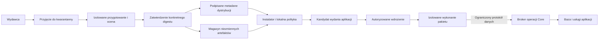

# Geode i Core: pochodzenie, dopuszczenie i izolacja pakietów

> Dokument opisuje wcześniejszą wersję. W 0.3 produkcyjne rozszerzenia TS są wyłączone; obowiązują deklaracje JSON, katalog i wydania v3 oraz updater 2. Aktualny proces i ograniczenia: [kontrolowany produkt 0.3](15-kontrolowany-produkt-0.3.md).

> Część granic zaufania wdrożono w kodzie 0.2.0-alpha.1; dokładny stan i luki opisuje [dokument 14](14-publiczne-wydanie-0.2.md). Ten dokument określa szerszą architekturę docelową, a nie deklarację wykonania lub zweryfikowania wszystkich elementów.

**Status: projekt architektury z 2026-10-07, do implementacji.** Wymaganiem jest odporność aplikacji na podmianę źródła i na szkodliwe zachowanie pakietu. Dokument nie potwierdza takich własności obecnego kodu. W tej pracy nie uruchomiono testów, buildów, lintów, skanów ani prób izolacji. Wybór konkretnych bibliotek TUF i środowiska wykonawczego pozostaje otwarty.

Aktualizacje samego Core, pozostałych komponentów platformy i całych aplikacji rozwija [13 — Aktualizacje całego Lattis](13-architektura-aktualizacji-lattis.md), w tym niezależny aktualizator, migracje i odzyskiwanie po awarii.

## 1. Wymaganie i granice gwarancji

Core ma odrzucać pakiet z nieautoryzowanego źródła, nie dopuszczać do wykonania innych bajtów niż zatwierdzone i ograniczać skutki złośliwego działania nawet prawidłowo podpisanego pakietu. Adres URL jest lokalizacją transportu, a nie podstawą zaufania.

Rozdzielamy trzy decyzje:

1. **Pochodzenie:** kto autoryzował dokładny artefakt i z jakiego procesu wydania pochodzi?
2. **Dopuszczenie:** czy ta wersja, jej zależności i wymagane uprawnienia spełniają politykę Geode oraz konkretnej aplikacji?
3. **Wykonanie:** jakie operacje środowisko technicznie pozwala temu pakietowi wykonać?

Podpis, przegląd kodu, atestacja builda i wynik skanowania nie dowodzą braku szkodliwego zachowania. Zgodnie z [przeglądem TUF](https://theupdateframework.io/docs/overview/) ochrona procesu aktualizacji nie rozstrzyga, czy poprawnie podpisany program jest nieszkodliwy. Nie obiecujemy braku wszystkich błędów, wycieku przez świadomie przyznany dostęp ani odporności na przejęcie hosta, brokera, całego progu kluczy zaufania lub pierwotnej dystrybucji Core.

Własność do osiągnięcia: **pakiet nie może sam ustanowić swojego zaufania, rozszerzyć swoich uprawnień ani ominąć granicy wykonania przez zmianę źródła, nazwy, manifestu lub konfiguracji projektu.** Dotyczy to także pakietów oznaczonych jako oficjalne. Administrator hosta mogący zmienić Core pozostaje poza tą gwarancją.

## 2. Stan obecnego kodu

Poniższe obserwacje wynikają z odczytu źródeł, bez wykonania kodu.

| Miejsce | Obecne zachowanie | Konsekwencja dla projektu |
|---|---|---|
| `src/cli.ts`, `request` | Adres pochodzi z `GEODE_BASE_URL`; token jest dołączany do żądania do tego adresu. | Konfiguracja adresu wpływa zarówno na źródło danych, jak i odbiorcę poświadczenia. |
| `src/cli.ts`, `install` | Sprawdza fingerprint wydawcy z konfiguracji projektu, digest i podpis. Pobiera paczkę do cache i zapisuje lockfile, nie wykonuje jej. | To część kontroli integralności, bez niezależnej polityki oficjalnego rejestru i dopuszczenia. |
| `src/cli.ts`, `install` | Zależności i zgodność odczytuje z manifestu w odpowiedzi metadanych; wynik `unpack(bytes)` nie służy do tych decyzji. | Resolver musi korzystać z manifestu związanej podpisem zawartości i sprawdzać zgodność wszystkich tożsamości. |
| `src/geode.ts`, `publish` | Po kontroli tokenu, namespace, formatu i podpisu zapisuje wersję jako `published`. | Publikacja nie zawiera osobnego etapu kwarantanny i dopuszczenia. |
| `src/runtime.ts`, `loadLocalModules` | Importuje `trustedModules` do procesu Core, zanim zakończy kontrole eksportowanych Nodes i tras. | Kod modułu wykonuje się już podczas importu; późniejsza walidacja nie jest granicą bezpieczeństwa. |
| `src/runtime.ts`, `src/app-server.ts` | Kontekst lokalnego Node zawiera klienta bazy; moduł działa ze środowiskiem i uprawnieniami procesu. | Deklaracje capabilities i referencje sekretów nie izolują złośliwego modułu. |
| `src/release.ts`, `prepareRelease` | Sprawdza przypięte artefakty i generuje deskryptor z digestem; liczy także digests lokalnych modułów. | Runtime nie wymaga uwierzytelnionego deskryptora wydania i nie wiąże nim ładowania modułów. Sam hash deskryptora nie autoryzuje wdrożenia. |

Nie ma obecnie automatycznego wykonania paczki przez `geode:install`. Zachowujemy tę granicę. Skopiowanie pobranego kodu do `trustedModules` nie może stać się projektowanym sposobem aktywacji rozszerzeń.

## 3. Podział komponentów i zaufania

Geode API, panel, magazyn artefaktów i baza katalogu nie mają kluczy pozwalających samodzielnie autoryzować dowolną nową paczkę. Publikują i dostarczają materiały zatwierdzone przez osobny proces. Kompromitacja serwera dystrybucji nie powinna wystarczać do ustanowienia nowego wydawcy, rozszerzenia uprawnień lub podmiany dopuszczonego artefaktu.

Procesy przyjęcia i przygotowania nie mają dostępu do danych klientów ani sekretów produkcyjnych. Rozpakowanie, analiza i ewentualny build obcej paczki także należą do powierzchni ataku i odbywają się w środowisku jednorazowym, o ograniczonych prawach. Proces wykonujący obcy build nie dostaje klucza dopuszczenia ani możliwości samodzielnego zatwierdzenia swoich wyników.

## 4. Pochodzenie i dystrybucja

Oficjalny Core otrzymuje początkowe metadane zaufania w ramach zweryfikowanej dystrybucji Core. Nie pobiera początkowego klucza z adresu wskazanego w `.env`. Autentyczność pierwszego instalatora oraz kolejnych wydań Core jest osobnym wymaganiem procesu wydawniczego.

Proponowana podstawa protokołu aktualizacji to utrzymywana implementacja **TUF**: podział ról, progi podpisów, rotacja i odwołanie kluczy, wersjonowanie, limity oraz ważność metadanych. Nie implementujemy własnego odpowiednika TUF na bazie pojedynczego podpisanego pliku JSON. Metadane muszą wiązać dopuszczony rekord pakietu, jego długość i digest z konkretnym snapshotem. Szczegóły: [specyfikacja TUF](https://theupdateframework.github.io/specification/v1.0.36/).

Propozycja dla root: próg 2 z 3 niezależnie przechowywanych kluczy offline; protokół musi określać ich właścicieli, procedurę odzyskania i zmianę kluczy. Konto publikujące paczki, klucz wydawcy, klucze dopuszczenia i klucze root są osobnymi uprawnieniami. Przejęcie jednego tokenu publikacji nie daje prawa do dopuszczenia ani zmiany root. Dla oficjalnych wydań dopuszczenie wymaga niezależnego zatwierdzenia dokładnego digestu, a nie automatycznego podpisania każdej publikacji.

`geode.lattis.build` jest początkowym endpointem. DNS i HTTPS zapewniają transport. Zmiana transportu nie zmienia tożsamości rejestru. Ewentualne nowe endpointy i mirrory muszą pochodzić z uwierzytelnionego dokumentu dystrybuowanego jako chroniony target; to dodatkowy kontrakt Lattis, a nie samoistna funkcja DNS lub TUF. Klient nie wysyła tokenów do dowolnego mirrora. Zmiana odbiorcy poświadczeń wymaga osobnej polityki audience i origin. Przekierowania nie omijają tych zasad.

Pełna tożsamość to co najmniej `registryId + publisherId + packageName + version + digest`. Tożsamość wydawcy nie może opierać się wyłącznie na edytowalnym slug. Oficjalna przestrzeń `@lattis/*` ma delegację od oficjalnego root; prywatny rejestr o takim samym slugu nie otrzymuje tej delegacji. Nowe klucze lub zmiana właściciela nazwy wymagają autoryzowanej rotacji, nie samej aktualizacji rekordu w bazie Geode.

Przed przyjęciem pakietu klient sprawdza:

1. Łańcuch zaufania, wymagane podpisy, wersje i ważność metadanych.
2. Dopuszczenie dla dokładnej tożsamości i digestu, z właściwej roli i polityki.
3. Rozmiar podczas strumieniowego pobierania oraz digest dokładnych bajtów.
4. Manifest wewnątrz artefaktu: nazwę, wersję, rodzaj, kompatybilność, zależności i uprawnienia. Dane pomocniczego API nie mogą zastępować tego manifestu.
5. Cały graf zależności według tych samych zasad, również zależności dołączone do artefaktu. Brak automatycznego przejścia do npm, innego rejestru lub nowego wydawcy.
6. Lokalne reguły aplikacji oraz najnowszy dostępny, uwierzytelniony stan unieważnień.

Parser działa z limitami długości, głębokości, liczby plików, zależności i czasu, także dla podpisanych danych. Paczka nie uruchamia skryptów instalacyjnych, nie modyfikuje projektu, konfiguracji zaufania ani Core. Materiał wykonywalny jest zamknięty w niezmiennym artefakcie; żadnego pobierania brakującego kodu w runtime. Zależności systemowe i obrazy runnera też wymagają przypięcia i kontroli pochodzenia.

## 5. Przyjęcie, dopuszczenie i wydanie aplikacji

Kwarantanna i dopuszczenie są oddzielne od widoczności `public/private`, oferty, licencji oraz prawa do pobrania. Żadna z tych własności biznesowych nie nadaje prawa do wykonania kodu.

Cykl wersji: `quarantined → admitted` albo `quarantined → rejected`; dopuszczona wersja może zostać `revoked`. Etykieta `official` oznacza autoryzowaną tożsamość, nie zwolnienie z bramek. Nowa wersja zawsze wymaga nowego dopuszczenia. Publiczny katalog instalacyjny pokazuje domyślnie wyłącznie dopuszczone wersje; kandydaci mają osobną powierzchnię dla wydawców i recenzentów.

Rekord dopuszczenia wiąże digest artefaktu, tożsamość wydawcy, manifest, dokładny zestaw zależności, profil uprawnień, wersję polityki, model wykonania oraz dowody oceny. Dla budowanych artefaktów obejmuje oczekiwane repozytorium, rewizję, workflow i buildera. Sam fakt posiadania atestacji nie wystarcza: klient lub zaufany weryfikator porównuje ją z oczekiwaniami polityki. Podstawa: [SLSA — weryfikacja artefaktów](https://slsa.dev/spec/v1.2/verifying-artifacts).

Przegląd kodu, analiza zależności, SBOM, sprawdzanie sekretów, próby zachowania i skany są dowodami dla procesu dopuszczenia, a nie dowodem nieszkodliwości. Nie wykonano ich w ramach tego projektu; uruchamianie takich działań w tym repo wymaga wyraźnego polecenia użytkownika. Brak wymaganych dowodów oznacza brak dopuszczenia, nie automatyczny wyjątek.

Instalator tworzy kandydata, nie nadpisuje aktywnego lockfile. Kandydat zawiera dokładne digests wszystkich pakietów i ich uprawnień. Nowe uprawnienie lub istotne rozszerzenie zakresu danych wymaga osobnego zatwierdzenia przez właściciela aplikacji albo wcześniej ustanowioną, ograniczoną politykę wdrożeń.

Autoryzowany proces wdrażania zatwierdza niezmienny deskryptor całego wydania: Core, pakiety, zależności, uprawnienia, konfigurację bez sekretów, profil runnera oraz plan migracji. Runtime przyjmuje tylko taki zestaw i sprawdza zgodność materializowanych bajtów przed wykonaniem. Cache, zatwierdzone wydania i polityka zaufania są poza prawem zapisu pakietu i zwykłego edytora workspace. Użycie niezmiennych obrazów/mountów ma eliminować podmianę pliku między kontrolą a importem.

MCP i panel mogą proponować kandydatów. Prawo do edycji źródeł lub instalacji nie daje prawa do podpisania wydania, zmiany root czy dopuszczenia uprawnień. README i opisy Geode nie są poleceniami dla procesu wdrożeniowego ani agentów. Edycja `trustedModules` przez edytora nie może aktywować kodu na produkcji przy kolejnym restarcie.

## 6. Wykonanie odporne na szkodliwy pakiet

Każdy pakiet dostarczany jako rozszerzenie z Geode, także oficjalny, jest projektowany jako niezaufany względem procesu Core. Nie wolno importować go do Core, Admin, procesu wdrożenia ani brokera. Podpis i dopuszczenie nie znoszą tej granicy.

Osobny proces jest koniecznym rozdzieleniem, ale nie wystarcza, jeśli dzieli użytkownika, sekrety, wolumeny i sieć z Core. Runner wymaga granicy egzekwowanej przez system operacyjny lub wirtualizację: osobnej tożsamości, odcięcia procesów hosta, ograniczenia syscalli, braku uprawnień administracyjnych, limitów zasobów i kontrolowanych mountów. Dla modelu celowo złośliwych pakietów preferowany jest izolowany runner z granicą VM/microVM; wybór technologii i założenia jego bezpieczeństwa wymagają osobnej decyzji i weryfikacji. Zwykły kontener witryny z Core i pakietem wewnątrz nie zapewnia izolacji między nimi.

Wymagany profil runnera:

- Brak środowiska, plików i sekretów Core, dostępu do hostowych procesów, inspectora, socketu Docker oraz urządzeń.
- Artefakt tylko do odczytu, ograniczony katalog tymczasowy, brak zapisu do innych pakietów i do zatwierdzonych wydań.
- Brak bezpośredniego dostępu do bazy i sieci; wyłącznie dedykowany kanał do brokera, odseparowany od Internetu i innych instancji.
- Limity CPU, pamięci, liczby procesów, czasu, wielkości komunikatów, wywołań brokera oraz przestrzeni dyskowej.
- Oddzielenie tenantów i pakietów oraz reset środowiska pomiędzy domenami zaufania; brak współdzielenia globalnego stanu niezaufanych rozszerzeń.

`node:vm`, worker threads, samo `child_process`, TypeScript i walidacja manifestu nie są wystarczającą granicą. Sam [Node.js Permission Model](https://nodejs.org/api/permissions.html) również nie gwarantuje izolacji złośliwego kodu. Może być dodatkową warstwą, nie fundamentem tej gwarancji.

### Broker operacji

Runner wymienia wyłącznie ograniczone, serializowalne komunikaty. Nie otrzymuje obiektów `AppClient`, `SecretAccess`, funkcji hosta ani referencji do pamięci Core.

Broker sam ustala tożsamość pakietu z autoryzowanego uruchomienia, a użytkownika i tenant z kontekstu uwierzytelnionego żądania. Nie ufa polom `publisher`, `principal`, `tenant` lub `package` przesłanym przez runner. Każda operacja wymaga przecięcia praw użytkownika, zatwierdzonych praw pakietu i zakresu konkretnego wywołania. Pakiet nie może pożyczyć praw administratora przez wewnętrzne wywołanie innego Node.

Zamiast dowolnego SQL broker udostępnia konkretne operacje na określonych zasobach, z kontrolą właściciela/tenanta, pól, liczby rekordów i skutków. Sam namespace tabel nie ogranicza odczytu wszystkich danych w danej domenie. Operacje zapisu i ich idempotencja pozostają pod kontrolą brokera; nie współdzielimy klienta transakcji z obcym procesem.

Integracje zewnętrzne preferują operację typu „utwórz fakturę przez zatwierdzone połączenie” zamiast wydania pakietowi tokenu API lub ogólnego HTTP. Broker ogranicza odbiorców, metody i payload, odrzuca SSRF do localhost, sieci prywatnych i metadanych hosta, ponawia kontrolę przy zmianie rozwiązanego adresu i przekierowaniu. Sama allowlista domen nie blokuje wycieku w treści legalnego żądania. Dostęp do danych i możliwości ich wysyłania musi być oceniany łącznie.

Core traktuje wynik pakietu jak niezaufane dane: waliduje format, limity i semantykę operacji. Wynik nie może definiować polityki dostępu, dowolnych tras hosta, kodu walidatora, SQL ani komend shell. Shard deklaruje routing jako dane; Core sam rejestruje ograniczone trasy. Kod lub HTML dla przeglądarki wymaga osobnego modelu izolacji i nie jest automatycznie dopuszczany do origin aplikacji przez zgodę na backendowy Node.

### Dane i migracje

Pobrany Shard nie dostaje konta DDL ani możliwości uruchomienia arbitralnego SQL na bazie aplikacji. Migracje należą do osobnego, zatwierdzonego planu wdrożenia, z ograniczonym zakresem i kontem migracyjnym. Zakres musi być egzekwowany uprawnieniami bazy i kontraktem operacji, a nie wyszukiwaniem zakazanych słów w SQL. Przeniesienie dowolnego SQL do osobnego procesu nie ogranicza jego skutków w bazie.

## 7. Zagrożenia i oczekiwane zachowanie

| Próba ataku | Oczekiwane zachowanie projektu |
|---|---|
| Podmiana URL/DNS lub fałszywe API | Brak wymaganych podpisów i autoryzacji oficjalnego rejestru blokuje przyjęcie; poświadczenia nie trafiają do niezatwierdzonego origin. |
| Podmiana paczki lub manifestu API | Rozmiar/digest i zgodność manifestu wewnątrz podpisanego artefaktu blokują przyjęcie. |
| Podszycie przez prywatny rejestr i slug `lattis` | Brak oficjalnej delegacji i inny `registryId` blokują uznanie za oficjalny pakiet. |
| Przejęty token publikacji albo klucz wydawcy | Napastnik może dostarczyć kandydata; niezależne dopuszczenie dokładnych bajtów nadal jest wymagane. |
| Stary poprawnie podpisany katalog | Kontrole wersji i ważności blokują nowe instalacje/aktualizacje po wykryciu cofnięcia lub wygaśnięcia. |
| Podmieniona zależność albo zdalny kod w runtime | Pełny graf przypiętych artefaktów i brak swobodnej sieci blokują obejście przez zależność. |
| Złośliwy dopuszczony Node odczytuje `.env`, bazę lub wywołuje shell | Runner i broker odmawiają dostępu spoza zatwierdzonego zakresu; sam podpis nie jest tu obroną. |
| Edytor workspace zmienia `trustedModules` lub pliki cache | Brak nowego autoryzowanego wydania i zgodności digests blokuje aktywację. |
| Pakiet wyczerpuje zasoby albo wysyła nieograniczone wyniki | Limity kończą jego wykonanie i chronią pozostałe aplikacje zgodnie z przyjętą granicą izolacji. |

Unieważnienia mają uwierzytelniony zakres: konkretny digest, wydanie albo klucz, z wersją i przyczyną. Blokują nowe dopuszczenie i wdrożenie wskazanego materiału. Dla działającego pakietu polityka lokalna określa odcięcie brokera i zatrzymanie tego runnera; nie uruchamia dowolnego kodu „naprawczego” z Geode ani nie zatrzymuje bezwarunkowo całej aplikacji.

Awaria Geode nie zatrzymuje zatwierdzonego wydania aplikacji. Bez świeżych wymaganych metadanych nie tworzymy nowych instalacji, aktualizacji ani wdrożeń pakietów. Działanie z ostatnim znanym stanem nie jest gwarancją poznania nowych unieważnień: tryb offline jawnie ma tę granicę. Wycofanie do poprzedniego wydania wymaga lokalnej autoryzacji, kontroli unieważnień i zgodności migracji; nie wolno w tym celu cofać wersji metadanych zaufania.

## 8. Kolejność implementacji i granica fazy 1

1. **Oddzielenie zaufania od konfiguracji i transportu:** wspólny klient rejestru dla CLI/Admin/MCP, oficjalny root i tożsamości, oddzielne prywatne rejestry, ograniczenie origin poświadczeń. Domyślny URL sam nie wystarcza.
2. **Integralny kandydat:** resolver używa manifestu wewnątrz artefaktu, sprawdza tożsamość, cały graf i limity; atomowo zapisuje osobnego kandydata. Nie zmienia aktywnego wydania.
3. **Geode z dopuszczeniem i TUF:** kwarantanna, niezależna autoryzacja, chronione metadane, rotacja, unieważnienia oraz procedura odzyskania. Brak dowodów oznacza zatrzymanie promocji.
4. **Autoryzowane wydania aplikacji:** runtime wymaga zatwierdzonego zestawu, chroni go przed edytorem workspace i ponownie wiąże wykonanie z bajtami. Także lokalny kod własny ma kontrolowany proces wydania.
5. **Broker i izolowany runner:** nowy kontrakt serializowalnych Nodes/Shards, operacje danych, integracji i migracji; brak przekazywania obecnego `NodeContext` poza granicę zaufania.
6. **Weryfikacja po osobnym poleceniu użytkownika:** próby adversarialne powyższych przypadków, granicy runnera, parserów, zależności, uprawnień, odzyskania kluczy, cofnięcia i odtwarzania. Dopiero wyniki pozwolą oceniać osiągnięte własności.

Do czasu wdrożenia i weryfikacji granicy wykonania **pakiety z Geode pozostają danymi do pobrania i przypięcia, bez aktywacji jako rozszerzenia**. W fazie 1 pakiety obcych wydawców nie działają w procesie aplikacji. Własne lokalne moduły, świadomie rozwijane i wydawane jako kod aplikacji, pozostają częścią zaufanej bazy kodu na równi z Core; obecny mechanizm `trustedModules` nie zapewnia odporności na ich złośliwe zachowanie. Samo pobranie paczki, oficjalna etykieta lub zgodność podpisu nie może automatycznie przenosić jej do tej kategorii.

Publiczny rejestr na Enhance i strona `lattis.build` mogą być osobnymi witrynami. Geode nie musi wykonywać dostarczanych paczek. Środowisko budowania obcych paczek i przyszły runner wymagają odrębnej granicy od witryny, procesu Core i panelu Enhance; uprawnienia właściciela całego serwera nie zastępują izolacji pakietów. Nie zakładamy, że standardowe uruchomienie Node.js w kontenerze witryny spełnia opisany profil.

Dokument rozwija granice opisane w [03 — Bezpieczeństwo i wydania](03-bezpieczenstwo-i-wydania.md) i [06 — Kompozycja i porty](06-kompozycja-porty-i-backlog.md). Przyszła implementacja wymaga aktualizacji kontraktów manifestu, instalatora, Geode API, runtime i wdrożeń; nie jest to pojedyncza poprawka adresu URL.
