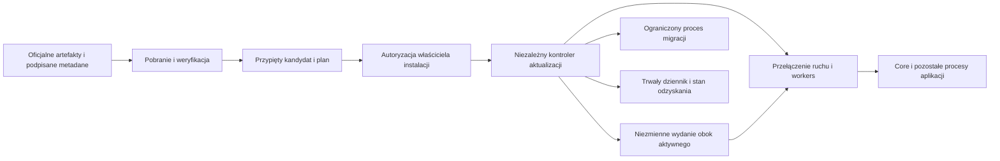

# Aktualizacje całego Lattis: zaufanie, wdrożenie i odzyskiwanie

> Dokument opisuje wcześniejszą wersję. W 0.3 produkcyjne rozszerzenia TS są wyłączone; obowiązują deklaracje JSON, katalog i wydania v3 oraz updater 2. Aktualny proces i ograniczenia: [kontrolowany produkt 0.3](15-kontrolowany-produkt-0.3.md).

> Część granic zaufania wdrożono w kodzie 0.2.0-alpha.1; dokładny stan i luki opisuje [dokument 14](14-publiczne-wydanie-0.2.md). Ten dokument określa szerszą architekturę docelową, a nie deklarację wykonania lub zweryfikowania wszystkich elementów.

**Status: projekt architektury z 2026-10-07, do implementacji.** Rozszerza [12 — Geode: zaufanie i izolacja](12-geode-zaufanie-i-izolacja.md) na cały system: Core, Auth, Admin, MCP, brokera, runnerów, workers, pakiety, frontend aplikacji, migracje i sam aktualizator. Dokument nie opisuje istniejącego mechanizmu aktualizacji ani potwierdzonej odporności. Nie wykonano testów, buildów, lintów, skanów, migracji, wdrożeń ani innych weryfikacji.

## 1. Cel i zasady

Aktualizacja ma wprowadzać wyłącznie autoryzowane, dokładnie określone artefakty do właściwej instalacji. Pobranie, dopuszczenie przez Lattis i zgoda właściciela instalacji są osobnymi decyzjami. Sam numer wersji, URL, etykieta `official`, digest lub poprawny podpis pojedynczego wydawcy nie wystarczają.

Wymagane własności projektu:

- Publikacja paczki Node/Shard nie daje możliwości aktualizacji Core, aktualizatora ani polityki zaufania.
- Proces Core, panel, MCP i runner nie mają prawa zapisu do aktywnego kodu, repozytorium zatwierdzonych wydań, kluczy i stanu aktualizatora.
- Nowy Core nie weryfikuje ani nie autoryzuje sam swojego pierwszego uruchomienia. Robi to wcześniej zainstalowany, niezależny aktualizator.
- Produkcja nie rozwiązuje nowych zależności npm, nie wykonuje skryptów instalacyjnych paczki i nie buduje aplikacji podczas przełączania wydania.
- Zmiana pakietu nie rozszerza automatycznie uprawnień, dostępnych sekretów, kont bazodanowych ani sieci.
- Brak Geode lub infrastruktury aktualizacji nie zatrzymuje działającego, zatwierdzonego wydania. Niepewność blokuje promocję nowego wydania.

Podpis i pochodzenie nie dowodzą poprawności lub nieszkodliwości nowego Core. Core obsługujący dane aplikacji jest częścią zaufanej bazy systemu; błędnie dopuszczony, złośliwy Core może nadużyć legalnego dostępu do tych danych. Niezależna autoryzacja, minimalne uprawnienia, izolacja komponentów i etapowe wdrożenie ograniczają ryzyko, lecz nie dają obietnicy wykrycia każdego szkodliwego programu.

## 2. Stan obecny i ścieżki do zastąpienia

Obserwacje z odczytu źródeł, bez uruchamiania kodu:

| Miejsce | Stan | Brakująca granica |
|---|---|---|
| `src/cli.ts`, `init` | Projekt zależy od lokalnego checkoutu Core przez `file:`. | Zmienny katalog deweloperski nie jest autoryzowanym artefaktem produkcyjnym. |
| `src/cli.ts`, `vendorCore` | Tworzy `.tgz` przez `npm pack --ignore-scripts` i zmienia zależność aplikacji. | Brak oficjalnej autoryzacji wydania, provenance i powiązania pełnego środowiska z tym artefaktem. |
| `src/release.ts`, `prepareRelease` | Zapisuje opis kandydata z hashami, wersjami, modułami i migracjami. | Deskryptor nie ma niezależnej autoryzacji; hash zawartości nie określa, kto może ją wdrożyć. |
| `package.json`, `bin/lattis.js` | Core ma zależności npm i uruchamia źródła przez `tsx`; CLI uruchamia kod zainstalowanego Core. | Obecne CLI nie jest niezależnym weryfikatorem dla wymiany samego Core. Środowisko wykonania i zależności też wymagają przypięcia. |
| `src/cli.ts`, `db:*` | Migracje Core/Auth/Admin/Geode/projektu są osobnymi poleceniami. | Brak wspólnego, uwierzytelnionego planu aktualizacji, dziennika operacji i deklaracji kompatybilności wszystkich schematów. |
| `src/app-server.ts` | Ma liveness, readiness i obsługę drenażu. | Brak kontrolera wdrożenia; gotowość API nie potwierdza bezpieczeństwa, zgodności danych, workers ani wykonania całości planu. |
| `src/remote-workspace.ts`, `src/runtime.ts` | Edytor może zmieniać źródła i konfigurację modułów; runtime importuje lokalne moduły. | Workspace i produkcyjne wydanie muszą być rozdzielone także prawami systemowymi, żeby restart nie aktywował edycji. |

Dotychczasowe `vendor-core` i `release:prepare` mogą pozostać narzędziami przygotowania w środowisku deweloperskim. Nie mogą stanowić alternatywnej drogi produkcyjnej omijającej nowy aktualizator i autoryzację wydania.

## 3. Dwie tożsamości wydania

**Wydanie platformy Lattis** jest zatwierdzane przez Lattis. Określa dokładne artefakty komponentów platformy, ich zależności, środowisko uruchomienia i ograniczenia kompatybilności. Zawiera dowody pochodzenia oraz plan zmian schematów Core/Auth/Admin/Geode, jeśli te komponenty są wdrażane. Nie autoryzuje samodzielnie zmian domeny aplikacji klienta.

**Wydanie aplikacji** jest zatwierdzane przez właściciela tej aplikacji lub jego wcześniej ustanowioną, ograniczoną politykę automatyzacji. Łączy wybrane wydanie Lattis z własnym kodem, frontendem, pakietami, uprawnieniami, konfiguracją bez sekretów i migracjami domenowymi. Oficjalna nowa wersja Lattis nie oznacza automatycznej zgody na jej wdrożenie w każdej instalacji.

Aktualizacja Core, Auth i bibliotek w jego procesie jest zmianą całego przypiętego zestawu zależności. Deklaracja `^wersja` w źródłowym `package.json` może służyć pracy nad kandydatem, ale wdrażany bundle ma wyłącznie konkretne wersje, platformy, długości i digests. Frontend, procesy w tle, modele API, zdarzenia i schematy danych podlegają temu samemu manifestowi wydania aplikacji.

Geode jest oddzielnym wdrożeniem z własną bazą. Korzysta z tego samego modelu zaufania i aktualizatora, ale aktualizacja centralnego Geode nie migruje baz klientów ani nie wymusza aktualizacji ich aplikacji. Strona `lattis.build` jest zwykłą aplikacją Lattis i nie ma uprzywilejowanej ścieżki omijającej ten proces.

Node.js, system operacyjny, silnik bazy, hypervisor, panel Enhance i reverse proxy są zależnościami infrastruktury. Wydanie Lattis określa obsługiwane profile i minimalne wymagania, a nie instaluje dowolnych pakietów systemowych jako root. Aktualizacje tych usług mają osobny plan operatora, skoordynowany z kompatybilnością Lattis.

## 4. Podpisy, role i pochodzenie

Dystrybucja korzysta z fundamentu TUF opisanego w dokumencie 12: niezależne role, progi podpisów, ważność i wersjonowanie metadanych, rotacja oraz odwołanie kluczy. Role wydające Core, aktualizator, pakiety i politykę izolacji mają rozdzielone delegacje. Klucz wydawcy zwykłego Node nie może podpisać targetu Core ani nowego root. Szczegóły kontroli aktualizacji określa [specyfikacja TUF](https://theupdateframework.github.io/specification/v1.0.36/).

Przepływ wydania: przypięta rewizja źródeł → izolowany build → artefakt z pełnym zestawem zależności → dowody oceny i pochodzenia → niezależne dopuszczenie digestu → podpisane metadane dystrybucji. Workflow wykonujący build nie otrzymuje samodzielnej władzy nad kluczami root lub autoryzacją dowolnego wydania.

Polityka weryfikuje oczekiwane repozytorium, rewizję, tożsamość buildera, proces budowania i digest wyniku; nie przyjmuje dowolnego prawidłowo podpisanego provenance. Dowody muszą obejmować zależności i narzędzia odpowiednio do przyjętego modelu zagrożeń. [SLSA — weryfikacja artefaktów](https://slsa.dev/spec/v1.2/verifying-artifacts).

Kanały `stable` i inne są podpisanymi rekomendacjami wyboru, a nie zmiennymi plikami wykonywalnymi. Po wyborze plan przypina konkretny digest. Aktualizator utrwala najwyższe zaakceptowane wersje metadanych i nie cofa tego stanu razem z kodem aplikacji. Zaufanie do pierwszego instalatora wymaga niezależnej weryfikacji bootstrapu, poza kanałem dostarczającym sam instalator. Nie stosujemy `curl ... | sh` jako modelu ustanawiania zaufania.

## 5. Niezależny aktualizator

Aktualizator działa poza procesem Core, Admin, MCP i runnerów oraz poza edytowalnym workspace. Posiada własną tożsamość systemową i chroniony stan zaufania. Działająca aplikacja nie może go nadpisać, zmienić jego polityki ani żądać dowolnej komendy shell. Panel i CLI przekazują identyfikator kandydata i ograniczone żądania operacji, nie URL skryptu lub listę komend.

Minimalny podział uprawnień:

| Komponent | Dozwolone prawa | Prawa wykluczone |
|---|---|---|
| Edytor workspace/MCP | Zapis źródeł kandydata | Aktywne wydania, root zaufania, klucze wdrożeniowe i konta migracji |
| Fetcher/weryfikator | Ograniczona sieć, staging, odczyt i kontrolowana aktualizacja stanu metadanych | Produkcyjne dane, sekrety aplikacji, przełączenie ruchu |
| Kontroler wdrożenia | Ograniczone operacje na zatwierdzonych wydaniach i procesach tej instalacji | Dowolny build obcej paczki, ogólny shell z wejścia HTTP, dostęp do danych biznesowych bez potrzeby |
| Proces migracji | Konto i zakres wymagane przez konkretną zatwierdzoną migrację | Klucze root i dystrybucji, zmiana aktywnego kodu, pozostawienie konta DDL procesowi API |
| Core i pozostałe usługi | Odczyt swojego wydania, dane i sekrety według roli | Zapis wydania i stanu aktualizatora, modyfikacja innych usług |
| Runner pakietu | Ograniczone operacje brokera według dokumentu 12 | Uprawnienia aktualizatora i bezpośredni dostęp do hosta |

Jeśli infrastruktura wymaga uprzywilejowanego pomocnika, jego API ogranicza się do ustalonych operacji i lokalizacji, powiązanych z wcześniej zweryfikowanym planem. Żaden artefakt nie dostarcza hooka wykonywanego jako root. Jedno konto systemowe dla edytora, Core i aktualizatora nie spełnia tej granicy.

## 6. Kontrakt kandydata i plan aktualizacji

Uwierzytelniony kandydat zawiera co najmniej:

- `releaseId`, digest manifestu, tożsamość wydawcy platformy, format protokołu i wymagany zakres wersji aktualizatora.
- Dokładne artefakty Core, CLI, Admin, MCP, brokera, workers, runnerów i frontendu, jeśli występują w tej instalacji; ich długości, digests, platformę i architekturę.
- Pełny graf zależności, runtime i profil izolacji; bez rozwiązywania zakresów wersji na serwerze produkcyjnym.
- Wymagane i zmieniane uprawnienia, zakres sekretów jako referencje, ustawienia istotne dla bezpieczeństwa oraz wersję polityki.
- Macierz kompatybilności procesów, API, schematów danych, sesji, zdarzeń i zadań w kolejce; obsługiwane wersje źródłowe aktualizacji.
- Przypięte migracje z checksumami, kolejnością, dialektem, zakresem konta, warunkami wejścia/wyjścia, semantyką wznowienia i informacją o odwracalności.
- Warunki gotowości, harmonogram przełączenia, plan wycofania lub naprawy do przodu oraz wymagane punkty odtworzenia.

Lokalny plan dodaje identyfikator aplikacji/środowiska, oczekiwany aktualny digest, zatwierdzony nowy digest, konfigurację, faktycznie nadane uprawnienia i autoryzację wdrożenia. Zmiana środowiska, zależności, migracji, uprawnień lub bajtów kandydata unieważnia dotychczasową zgodę. Sekrety nie trafiają do manifestów i logów; plan wiąże zatwierdzone referencje i zasady rotacji.

Plan podlega kontroli struktury i limitów przed jakimkolwiek wykonaniem. Nie importujemy nowego kodu, żeby dowiedzieć się, czy wolno go uruchomić. Rozpakowanie chroni przed wyjściem ze stagingu, symlinkami, hardlinkami, nadpisaniem plików, nieoczekiwanymi typami plików i wyczerpaniem zasobów. Produkcyjny artefakt dostarczamy jako gotowy, kompletny bundle lub obraz przypięty digestem. Prace budowania i oceny kandydata nie mają sekretów produkcyjnych.

## 7. Cykl wdrożenia i trwałość operacji

Stany procesu: `discovered → verified → planned → authorized → staged → migrating → candidate-ready → activating → observing → committed`. Każda faza ma trwały zapis wejścia i wyniku; błędy przechodzą do `failed`, `recovery-required` albo kontrolowanego `rolled-back`, zależnie od wykonanych skutków. Sam restart procesu nie oznacza powodzenia.

1. **Weryfikacja i planowanie:** kontrola pochodzenia, podpisów, świeżości, zgodności i polityki. Nie pobieramy kolejnego arbitralnego instalatora wskazanego przez nową paczkę.
2. **Autoryzacja:** lokalny właściciel lub wcześniej ustanowiona polityka zatwierdza dokładny plan. Polityka może automatyzować aktualizacje w określonym zakresie, oknie i bez rozszerzania uprawnień. Kanał `stable` nie jest zgodą na wszystko.
3. **Staging:** osobny niezmienny katalog/obraz, ponowna kontrola bajtów przed użyciem, wymagane miejsce na stare i nowe wydanie, chroniony dziennik oraz punkt odtworzenia danych. Nie nadpisujemy `node_modules` aktywnej aplikacji.
4. **Migracje kompatybilne:** osobny proces wykonuje dopuszczony plan `expand/backfill`, o ile stara wersja może nadal działać. Wymagania kontroli kandydata i odtworzenia są jawne, a nie zastępowane odpowiedzią `/health/ready`.
5. **Kandydat:** uruchomienie po autoryzacji z minimalnymi wymaganymi prawami. Przed promocją nie konsumuje produkcyjnych zadań ani nie wysyła e-maili, płatności i webhooków bez osobnego sterowania. Nie otrzymuje sekretów wdrożeniowych.
6. **Aktywacja:** kontroler przełącza ruch i ustalone role workers, z fencingiem dla zadań i drenażem starych procesów. Utrwala oczekiwany i obserwowany stan każdego komponentu. Atomowe przełączenie wskaźnika nie jest globalną transakcją obejmującą bazę, sieć i wszystkie procesy.
7. **Obserwacja i commit:** zgodnie z zatwierdzonym planem sprawdza sygnały działania i zapisuje aktywne wydanie. Poprzednie wydanie oraz dane odzyskania zachowuje według polityki retencji. `contract` jest osobną operacją po zakończeniu okresu zgodności.

Jedna instalacja ma jednego aktywnego koordynatora aktualizacji. Potrzebne są blokada/lease, fencing token, identyfikator operacji, kontrola oczekiwanego aktualnego digestu i odporne na powtórzenie kroki. Po awarii kontroler odtwarza faktyczny stan ruchu, procesów i migracji z dziennika; nie zakłada, że brak odpowiedzi oznacza brak skutku. Anulowanie jest możliwe tylko w zdefiniowanych punktach bezpiecznego zatrzymania.

## 8. Migracje i wycofanie

Wydanie przypina migracje wszystkich używanych komponentów, w tym Auth. Nie uruchamia generatora nowej biblioteki Auth z kontem DDL bez uprzednio zatwierdzonego wyniku lub jawnie zatwierdzonej, przypiętej procedury o ograniczonych prawach. Start API nie wykonuje automatycznych migracji.

Aktualizacje stosują `expand → backfill → przełączenie → contract` wtedy, gdy faktycznie istnieje kompatybilność. Dla PostgreSQL i MariaDB plan uwzględnia różne własności transakcji DDL; nie zakłada atomowości migracji na obu silnikach. Długie migracje mają checkpointy, limity i jawne zasady wznowienia. Kolejne procesy nie mogą zastosować tej samej migracji równocześnie.

Współistnienie starego i nowego kodu wymaga kontraktów danych oraz wiadomości, które obsługują oba wydania. Dotyczy to także workers, sesji, zadań i formatów plików, nie tylko tabel. [Praktyka kompatybilności wielowersyjnej](https://docs.gitlab.com/development/multi_version_compatibility/).

| Moment błędu | Dopuszczona reakcja |
|---|---|
| Przed zmianą danych i ruchu | Odrzucić kandydata; aktywne wydanie działa dalej. |
| Po kompatybilnym `expand/backfill` | Przywrócić poprzedni kod tylko jeśli manifest i rzeczywisty stan danych nadal go dopuszczają; zachować wykonane kompatybilne zmiany. |
| Po przełączeniu i wykonaniu skutków zewnętrznych | Wycofać kod tylko przy zgodności danych i zdarzeń; zachować receipts/idempotencję. Nie powtarzać automatycznie płatności ani innych efektów. |
| Po nieodwracalnym `contract` lub zmianie formatu | Naprawa do przodu albo kontrolowane odtworzenie; brak automatycznego cofania kodu. |

Odtworzenie backupu/PITR jest operacją odzyskania danych, z uzgodnionym RPO/RTO, utratą ewentualnych późniejszych zapisów i rozliczeniem skutków zewnętrznych. Backup nie cofa wysłanego przelewu, wiadomości ani webhooka. Plan opisuje spójny zakres bazy i magazynów plików oraz zapisuje, który punkt odtworzenia pasuje do wydania. Sama obecność pliku backupu nie potwierdza możliwości odtworzenia.

Cofnięcie wydania aplikacji nie cofa wersji root/TUF ani listy znanych unieważnień. Poprzednia paczka musi nadal być dozwolona przez aktualną politykę. Powrót do znanej podatnej lub unieważnionej wersji wymaga odrębnej, ograniczonej decyzji odzyskiwania; nie jest automatyczną reakcją na błąd nowej wersji.

## 9. Aktualizacja aktualizatora i odzyskanie zaufania

Aktualizator jest małym, osobno wydawanym komponentem. Jego aktualizacja używa niezależnej delegacji i progu autoryzacji, jest weryfikowana przez dotychczasowy aktualizator i trafia do drugiego slotu. Poprzedni slot oraz lokalna ścieżka odzyskania pozostają dostępne do zakończenia operacji. Nowy aktualizator nie dziedziczy prawa do zmiany root dowolną instrukcją ze swojego manifestu.

Rotacja root następuje według protokołu zaufania, z wymaganymi podpisami poprzedniego i nowego zestawu oraz kontrolą wersji. Zmiana verifiera, polityki bezpieczeństwa lub minimalnego dopuszczonego poziomu izolacji jest aktualizacją o podwyższonym ryzyku; zwykła aktualizacja Node nie może jej przemycić jako zależności.

Po przejęciu całego wymaganego progu kluczy nie ma wiarygodnej naprawy wyłącznie przez ten sam skompromitowany kanał. Potrzebna jest wcześniej zaplanowana procedura odtworzenia zaufania poza tym kanałem, z uwierzytelnieniem operatora i kontrolą nowego bootstrapu. Stan wersji metadanych, czas wykorzystywany do ważności i dziennik aktualizacji wymagają ochrony przed zmianą przez aplikację; po utracie tego stanu nie wolno po cichu rozpoczynać od pustego zaufania.

## 10. Enhance i inne topologie

Witryna Node.js w Enhance może być miejscem uruchomienia zatwierdzonego Core, ale sam restart aplikacji przez panel nie stanowi zaprojektowanego aktualizatora. Jeśli panel uruchamia proces z katalogu, do którego ten sam użytkownik ma zapis, należy oddzielić workspace, wdrożone artefakty i konto kontrolera. Backend wdrożenia dla Enhance musi określić, jak egzekwuje te prawa i jak przełącza gotowe wydania bez dowolnych hooków shell.

Na pojedynczym procesie dopuszczamy kontrolowaną przerwę: drenaż, zatrzymanie, przełączenie i start. Wdrożenie z nakładaniem wersji wymaga co najmniej dwóch instancji oraz sterowania ruchem i workers. Brak gotowości brokera, runnera albo zgodnego schematu blokuje promocję całego zależnego zestawu. Usługi infrastruktury współdzielone przez wiele witryn są aktualizowane przez operatora według osobnego planu.

## 11. Kolejność implementacji i kryteria przyszłej weryfikacji

1. Wprowadzić wersjonowany manifest platformy, manifest aplikacji i plan aktualizacji. Rozdzielić kandydata, aktywne wydanie i zaufaną politykę.
2. Dodać dystrybucję TUF, niezależne dopuszczenie Core i aktualizatora oraz kontrolę provenance. Zdefiniować bootstrap, klucze i procedurę odzyskiwania.
3. Zbudować niezależny aktualizator z chronionym dziennikiem, stagingiem, limitami i backendem wdrożeniowym. Produkcyjne uruchomienie wymaga autoryzowanego manifestu.
4. Rozdzielić uprawnienia workspace, usług, migracji i deployera. Zablokować aktywację przez samą zmianę `trustedModules`, `package.json`, symlinka lub restart.
5. Wprowadzić koordynację procesów i migracji, trwałe wznowienie, fencing workers, kontrolowane wycofanie i odzyskiwanie danych.
6. Dodać izolację pakietów oraz brokera z dokumentu 12; oficjalny podpis pakietu nie pozwala ominąć tej granicy.
7. Dopiero na wyraźne polecenie użytkownika przeprowadzić weryfikacje implementacji. Przyszłe pipeline'y działają według jawnej polityki operatora; opis projektu nie jest poleceniem ich uruchomienia teraz.

Scenariusze wymagające późniejszych prób: podmieniony Core; prawidłowy podpis z niewłaściwej roli; zmanipulowane zależności i runtime; stary katalog; przejęty token publikacji; zmiana kandydata po zgodzie; próba zapisu wydania przez MCP/Core; skrypt instalacyjny; wyjście z katalogu podczas rozpakowania; przerwanie każdej fazy; równoległe aktualizatory; częściowa migracja obu dialektów; podwójne wykonanie zadania; błąd po przełączeniu; cofnięcie niezgodne z danymi; brak miejsca; brak Geode; utrata stanu; rotacja kluczy; aktualizacja aktualizatora oraz odtworzenie danych.

Osiągnięcie tych własności wymaga implementacji i wyników weryfikacji. Dotychczasowa ścieżka przygotowania wydania nie powinna być przedstawiana jako realizacja tego projektu.
